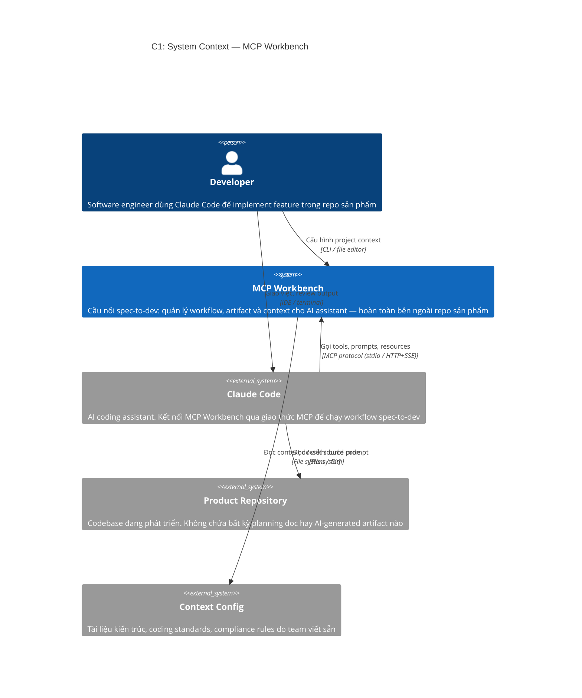
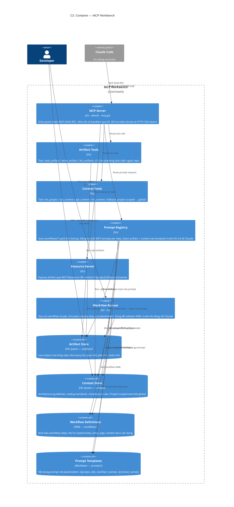

# MCP Workbench: Cầu nối Spec-to-Dev mà không tạo file trong repo

---

## 1. Đặt vấn đề

Khi dùng AI assistant (Claude Code, Cursor…) để phát triển tính năng, một quy trình điển hình trông như thế này:

1. Analyst viết **discovery** — phân tích yêu cầu
2. Designer viết **spec** — đặc tả tính năng
3. Engineer viết **technical plan** — thiết kế kỹ thuật
4. Tech Lead breakdown **tasks** — phân công việc

Vấn đề: những tài liệu này rất hữu ích trong quá trình làm việc, nhưng **không thuộc về repo của sản phẩm**. Chúng là output của quá trình tư duy, không phải source code. Nếu để trong repo:

- Phải thêm vào `.gitignore` từng file một
- Dễ bị commit nhầm gây nhiễu lịch sử git
- Mỗi developer có phiên làm việc riêng → xung đột path
- Mỗi AI agent cần biết phải lưu vào đâu, với format gì — không có chuẩn chung

Nếu xóa đi sau khi dùng → mất context, không thể trace lại quyết định thiết kế.

**Câu hỏi cốt lõi:** Làm sao để AI có thể thực hiện toàn bộ workflow spec→develop, sinh ra và đọc các tài liệu trung gian, mà **không tạo một file nào trong repo sản phẩm**?

---

## 2. Giải pháp: MCP Workbench

Ý tưởng: chạy một **MCP server riêng biệt** — gọi là *gateway* — đứng ngoài tất cả các repo sản phẩm. Claude Code kết nối vào gateway này qua giao thức MCP. Mọi artifact (discovery, spec, plan, tasks) được lưu **trong thư mục của gateway**, hoàn toàn tách khỏi repo đang phát triển.

Gateway cung cấp ba loại capability qua MCP:

| Loại | Tool / Prompt / Resource | Vai trò |
|---|---|---|
| **Tools** | `write_artifact`, `read_artifact`, `list_artifacts` | Claude ghi/đọc planning docs ngoài repo |
| **Tools** | `init_project`, `set_context`, `get_context`, `list_context` | Quản lý context (architecture, standards) |
| **Prompts** | `discover`, `spec`, `plan`, `tasks` | Template prompt đã inject sẵn context và artifact từ bước trước |
| **Resources** | `artifact://{project}/{feature}/{name}` | Đọc artifact qua URI |

Workflow chạy theo thứ tự step: mỗi step nhận một MCP prompt đã được gateway render đầy đủ → Claude điền output → gọi `write_artifact` → step tiếp theo đọc artifact vừa được tạo.

---

## 3. Thực hiện

### 3.1 C1 — System Context



**Điểm then chốt của C1:** Không có đường quan hệ nào từ gateway sang Product Repository. Gateway và repo sản phẩm hoàn toàn cô lập — đây chính là điều đảm bảo zero-intrusion.

---

### 3.2 C2 — Container



**Điểm then chốt của C2:** `Prompt Registry` là container trung tâm — nó kết nối tất cả luồng dữ liệu: đọc YAML định nghĩa workflow, load template markdown, inject artifact từ step trước và context docs của project, rồi trả về prompt đã hoàn chỉnh cho Claude. `MCP Server` chỉ là thin router không có logic nghiệp vụ.

Thêm workflow mới **không cần sửa code Go** — chỉ tạo `workflows/ten-workflow.yaml` và `prompts/ten-step.md`, restart server.

---

### 3.3 Luồng dữ liệu một workflow hoàn chỉnh

```
Developer mở Claude Code trong repo sản phẩm
        │
        ▼
Gọi MCP prompt "discover"
  (project_id=my-app, feature_id=export-csv, request="...")
        │
        ▼
Prompt Registry:
  - Đọc workflows/export-task-csv.yaml → lấy step "discover"
  - Render prompts/discover_requirement.md với {{request}}
        │
        ▼
Claude nhận prompt đầy đủ → sinh nội dung discovery
→ gọi write_artifact("my-app/export-csv/discovery", ...)
        │  lưu vào gateway/artifacts/my-app/export-csv/discovery.md
        ▼
Gọi MCP prompt "spec"
        │
        ▼
Prompt Registry:
  - Đọc artifact discovery.md → inject vào {{discovery}}
  - Render prompts/create_feature_spec.md
        │
        ▼
Claude sinh spec.md → write_artifact(...)
        │
        ▼
Gọi MCP prompt "plan"
        │
        ▼
Prompt Registry:
  - Inject spec.md + architecture.md + coding-standards.md
        │
        ▼
Claude sinh plan.md → write_artifact(...)
        │
        ▼
Gọi MCP prompt "tasks" → Claude sinh tasks.md
```

Tất cả file lưu trong `gateway/artifacts/` — **repo sản phẩm không bị chạm đến**.

---

## 4. Kết luận

MCP Workbench giải quyết một vấn đề thực tế và hay bị bỏ qua: **tách bạch lifecycle của tài liệu kỹ thuật khỏi lifecycle của source code**. Tài liệu spec không phải code, không nên sống trong repo code.

Bằng cách dùng MCP như giao thức chuẩn, gateway trở nên hoàn toàn trong suốt với Claude Code — developer không cần biết gateway đang chạy ở đâu, chỉ cần gọi prompt và tool như bình thường. Mọi artifact được quản lý ngoài repo, nhưng vẫn có thể đọc lại bất cứ lúc nào qua MCP resource URI.

Điểm mạnh của thiết kế:

- **Zero-intrusion** vào repo sản phẩm — không một file nào bị tạo thêm
- **Config-driven** — thêm workflow mới chỉ bằng YAML + Markdown, không sửa code Go
- **Portable** — cùng một gateway phục vụ nhiều project, nhiều feature độc lập với nhau

