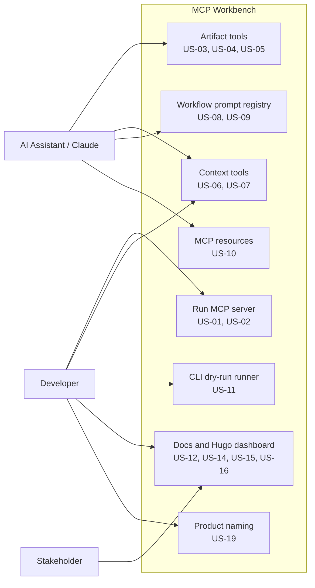
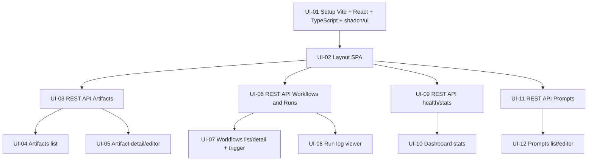
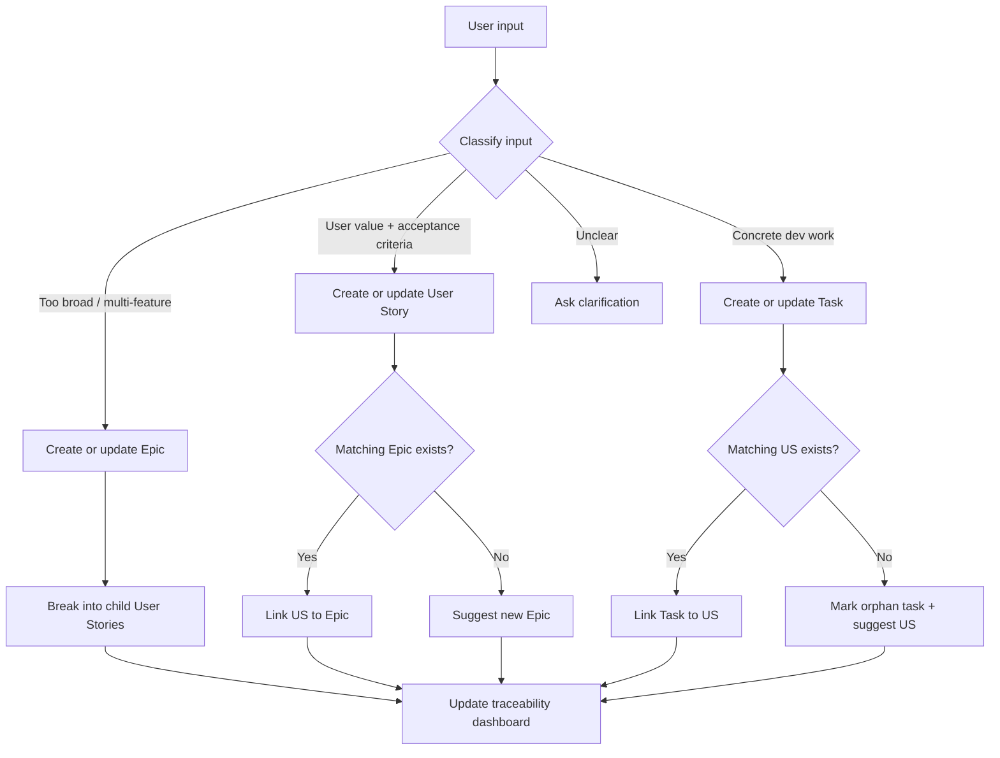

# Tổng hợp User Stories MCP Workbench

Tài liệu này tổng hợp lại các User Stories / project items đã thấy sau khi scan source code, workflow definitions, prompts, docs và artifacts hiện có.

## Nguồn rà soát

| Khu vực | Ghi nhận |
|---|---|
| `apps/mcp-server/src/tools/` | Artifact tools và Context tools đã có implementation |
| `apps/mcp-server/src/prompts/` | Dynamic workflow prompt registry đã có implementation |
| `apps/mcp-server/src/resources/` | Artifact resource template đã có implementation |
| `apps/mcp-server/src/workflow/` + `apps/mcp-server/cmd/workflow/` | CLI dry-run workflow đã có implementation |
| `workflows/` | Có workflow `init-project` và `export-task-csv` |
| `prompts/` | Có prompt templates cho discovery, spec, technical plan, tasks, init project |
| `apps/hugo-book-site/content/docs/` | Có dashboard docs cho getting started, Claude setup, content sources, ownership, context, prompts, artifacts |
| `docs/` | Có blog/architecture narrative và user story summary |
| `artifacts/demo/` | Có discovery và technical plan cho project React UI |

## Biểu đồ use case

### Tổng quan actors và capabilities



### Luồng spec-to-dev qua workflow

```mermaid
flowchart TD
    Request[User request] --> Discover[discover\nPrompt: discover_requirement.md]
    Discover --> Discovery[artifacts/{project}/{feature}/discovery.md]
    Discovery --> Spec[spec\nPrompt: create_feature_spec.md]
    Spec --> SpecDoc[artifacts/{project}/{feature}/spec.md]
    SpecDoc --> Plan[plan\nPrompt: create_technical_plan.md]
    Context[context/{project_id}/ + context/global/] --> Plan
    Plan --> PlanDoc[artifacts/{project}/{feature}/plan.md]
    PlanDoc --> Tasks[tasks\nPrompt: breakdown_tasks.md]
    SpecDoc --> Tasks
    Tasks --> TasksDoc[artifacts/{project}/{feature}/tasks.md]
```

### Luồng khởi tạo project context

```mermaid
flowchart TD
    Claude[Claude chat] --> InitPrompt[Prompt init]
    InitPrompt --> InitTool[init_project(project_id)]
    InitTool --> Templates[Create templates\narchitecture, coding-standards, compliance-rules]
    InitTool --> ContextIndex[Create context/{project_id}/_index.md\nUS-17]
    Templates --> SetContext[set_context x3]
    SetContext --> Architecture[context/{project_id}/architecture.md]
    SetContext --> Coding[context/{project_id}/coding-standards.md]
    SetContext --> Compliance[context/{project_id}/compliance-rules.md]
    SetContext --> ListContext[list_context(project_id)]
```

### Artifact documentation auto-index

```mermaid
flowchart TD
    WriteArtifact[write_artifact(path, content)] --> ValidatePath[Validate artifact path]
    ValidatePath --> CreateParents[Create parent folders]
    CreateParents --> EnsureIndexes[Ensure missing _index.md files\nUS-18]
    EnsureIndexes --> RootIndex[artifacts/_index.md]
    EnsureIndexes --> ProjectIndex[artifacts/{project}/_index.md]
    EnsureIndexes --> FeatureIndex[artifacts/{project}/{feature}/_index.md]
    EnsureIndexes --> ArtifactFile[Write artifact file]
    ArtifactFile --> HugoTree[Visible in Hugo docs tree]
```

### Backlog React UI



## US đã có trong code

| US ID | User Story | Trạng thái | Bằng chứng |
|---|---|---|---|
| US-01 | Là developer, tôi muốn chạy MCP Workbench như một MCP server để Claude Code có thể gọi tools, prompts và resources. | Done | `apps/mcp-server/main.go`, `apps/mcp-server/src/module/app.go`, `apps/mcp-server/src/config/config.go` |
| US-02 | Là developer, tôi muốn cấu hình transport MCP bằng environment variables để chạy gateway qua SSE hoặc stdio. | Done | `MCP_TRANSPORT`, `MCP_PORT`, `MCP_NAME`, `MCP_VERSION` trong `apps/mcp-server/src/config/config.go` |
| US-03 | Là AI assistant, tôi muốn ghi artifact vào `artifacts/` để lưu discovery/spec/plan/tasks ngoài repo sản phẩm. | Done | Tool `write_artifact` trong `apps/mcp-server/src/tools/artifact.go` |
| US-04 | Là AI assistant, tôi muốn đọc artifact đã sinh trước đó để dùng làm input cho bước tiếp theo. | Done | Tool `read_artifact` trong `apps/mcp-server/src/tools/artifact.go` |
| US-05 | Là developer, tôi muốn liệt kê artifact theo scope để kiểm tra output workflow. | Done | Tool `list_artifacts` trong `apps/mcp-server/src/tools/artifact.go` |
| US-06 | Là developer, tôi muốn khởi tạo context project chuẩn gồm architecture, coding standards và compliance rules. | Done | Tool `init_project` trong `apps/mcp-server/src/tools/context.go` |
| US-07 | Là developer, tôi muốn set/get/list context docs theo project, có fallback sang global context. | Done | Tools `set_context`, `get_context`, `list_context` trong `apps/mcp-server/src/tools/context.go` |
| US-08 | Là developer, tôi muốn thêm workflow mới chỉ bằng YAML và Markdown, không cần sửa Go code. | Done | Scan `workflows/*.yaml` và register prompt động trong `apps/mcp-server/src/prompts/workflow.go` |
| US-09 | Là AI assistant, tôi muốn prompt workflow tự inject artifact và context cần thiết theo step. | Done | `reads`, `context`, `extra_args` được render trong `apps/mcp-server/src/prompts/workflow.go` |
| US-10 | Là AI assistant, tôi muốn đọc artifact qua MCP Resource URI. | Done | Resource template `resource://artifact/{project}/{feature}/{name}` trong `apps/mcp-server/src/resources/artifact.go` |
| US-11 | Là developer, tôi muốn dry-run workflow local để validate YAML, prompts, reads/writes và context trước khi dùng thật với Claude. | Done | `apps/mcp-server/src/workflow/runner.go`, `apps/mcp-server/cmd/workflow/main.go`, `runs/export-task-csv.yaml` |
| US-12 | Là developer, tôi muốn có tài liệu hướng dẫn viết workflow và prompt để mở rộng hệ thống. | Done | `docs/workflow-guide.md` |
| US-13 | Là stakeholder/team member, tôi muốn có bài mô tả kiến trúc và lý do thiết kế MCP Workbench. | Done | `docs/blog.md` |
| US-14 | Là developer, tôi muốn chạy dashboard documentation bằng Hugo để xem prompts, workflows, context và artifacts trong một UI đọc được. | Done | `apps/hugo-book-site/`, service `hugo-book-site` trong `docker-compose.yml` |
| US-15 | Là developer, tôi muốn biết cách add MCP Workbench vào Claude Code để dùng tools/prompts từ chat. | Done | `apps/hugo-book-site/content/docs/add-to-claude.md` |
| US-16 | Là developer, tôi muốn phân biệt system app files, shared editable configuration và user workspace files để biết file nào nên sửa. | Done | `apps/hugo-book-site/content/docs/file-ownership.md` |
| US-17 | Là developer, tôi muốn context folders tự có `_index.md` khi tạo project/context mới để Hugo hiển thị section đúng. | Done | `init_project`, `set_context` trong `apps/mcp-server/src/tools/context.go` |
| US-18 | Là developer, tôi muốn artifact folders tự có `_index.md` khi `write_artifact` tạo folder mới để artifact docs xuất hiện trong Hugo tree. | Done | `write_artifact` trong `apps/mcp-server/src/tools/artifact.go` |
| US-19 | Là developer, tôi muốn MCP server metadata và docs dùng tên sản phẩm `mcp-workbench` thống nhất. | Done | `MCP_NAME`, `apps/mcp-server/src/config/config.go`, `apps/hugo-book-site/hugo.toml`, docs |

## Workflows đã có

| Workflow | Mục đích | Steps | Trạng thái |
|---|---|---|---|
| `init-project` | Khởi tạo context project qua MCP tools | `init` | Có YAML và prompt |
| `export-task-csv` | Workflow mẫu spec-to-dev cho tính năng export task CSV | `discover` -> `spec` -> `plan` -> `tasks` | Có YAML, prompts và run config mẫu |

## Project / feature artifacts đã có

| Project | Feature | Artifacts | Nội dung | Trạng thái |
|---|---|---|---|---|
| `demo` | - | `discovery`, `technical-plan` | Thêm React SPA UI cho MCP Workbench | Đã có discovery + technical plan, chưa thấy spec/tasks và chưa thấy code UI/API tương ứng |

## Backlog từ project React UI

Các item dưới đây được lấy từ `artifacts/demo/technical-plan.md`. Hiện tại repo chưa có thư mục `ui/` hoặc REST API `/api/...`, nên đang được xem là planned/backlog.

| Backlog ID | Hạng mục | Trạng thái scan |
|---|---|---|
| UI-01 | Setup Vite + React + TypeScript + shadcn/ui | Planned |
| UI-02 | Layout SPA với sidebar navigation | Planned |
| UI-03 | REST API Artifacts: list/read/write/delete | Planned |
| UI-04 | Artifacts list page | Planned |
| UI-05 | Artifact detail/editor + markdown preview | Planned |
| UI-06 | REST API Workflows và Runs | Planned |
| UI-07 | Workflows list/detail + trigger form | Planned |
| UI-08 | Run log viewer với polling | Planned |
| UI-09 | REST API health/stats | Planned |
| UI-10 | Dashboard stats + recent runs | Planned |
| UI-11 | REST API Prompts | Planned |
| UI-12 | Prompts list/editor | Planned |

## Future plan: Epic / User Story / Task intake

Mục tiêu tương lai là thêm một workflow intake để phân loại yêu cầu người dùng thành 3 cấp:

```txt
Epic
  -> User Story
    -> Task
```

Khi người dùng nhập yêu cầu mới, workflow sẽ:

- Phân loại input là `Epic`, `User Story`, `Task`, hoặc `Needs clarification`.
- Nếu input quá lớn, tạo `Epic` và break thành nhiều `User Story` nhỏ hơn.
- Nếu input là một `User Story`, map vào `Epic` phù hợp hoặc đề xuất Epic mới.
- Nếu input là `Task`, map vào `User Story` phù hợp hoặc đánh dấu orphan task.
- Sinh traceability dashboard: `Epic -> User Story -> Task`.

### Mermaid: intake decision flow



### Planned artifacts

| Artifact | Purpose |
|---|---|
| `artifacts/{project}/backlog/epics.md` | Danh sách Epic và scope lớn |
| `artifacts/{project}/backlog/user-stories.md` | User Story, acceptance criteria, Epic mapping |
| `artifacts/{project}/backlog/tasks.md` | Dev tasks theo FE/BE/DevOps/Docs |
| `artifacts/{project}/backlog/task-dashboard.md` | Dashboard tổng hợp status, priority, owner, traceability |

### Planned workflow

| File | Purpose |
|---|---|
| `workflows/intake-task.yaml` | Workflow phân loại Epic / User Story / Task |
| `prompts/intake_task.md` | Prompt phân tích input và tạo mapping |
| `prompts/create_task_dashboard.md` | Prompt sinh dashboard từ epics/user-stories/tasks |

### Future backlog items

| Backlog ID | Hạng mục | Trạng thái scan |
|---|---|---|
| BL-01 | Define Epic / User Story / Task markdown schema | Planned |
| BL-02 | Add `intake-task` workflow | Planned |
| BL-03 | Add prompt to classify request type | Planned |
| BL-04 | Add traceability dashboard artifact | Planned |
| BL-05 | Add orphan task detection and suggested parent US/Epic | Planned |

## Ghi chú trạng thái

- Code hiện tại tập trung vào MCP Workbench backend, workflow engine và Hugo documentation dashboard, chưa thấy frontend React SPA.
- `export-task-csv` là workflow/example dùng để chứng minh luồng spec-to-dev, không phải feature export CSV đã implement trong application domain.
- Artifact `demo` đang mô tả một project UI mới cho chính MCP Workbench; đây là kế hoạch kỹ thuật, chưa phải phần đã hoàn tất trong code.
